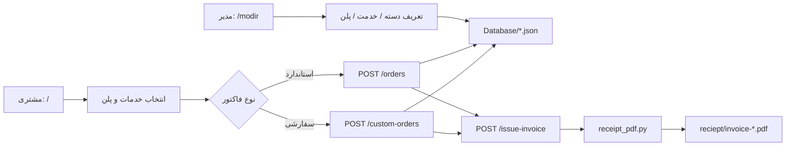

# Team Projects Management

سیستم مدیریت پروژه و صدور فاکتور برای **تیم بالتازار** — یک وب‌اپلیکیشن Flask با رابط کاربری فارسی (RTL) برای مدیریت خدمات، پلن‌ها، مشتریان و سفارش‌ها و تولید خودکار فاکتور PDF.

---

**لینک مشاهده پروژه :**

https://teamprojectsmanagement.onrender.com/

## فهرست مطالب

- [معرفی](#معرفی)
- [ویژگی‌ها](#ویژگی‌ها)
- [فناوری‌های استفاده‌شده](#فناوری‌های-استفاده‌شده)
- [پیش‌نیازها](#پیش‌نیازها)
- [نصب و راه‌اندازی](#نصب-و-راه‌اندازی)
- [ساختار پروژه](#ساختار-پروژه)
- [توضیح فایل‌ها](#توضیح-فایل‌ها)
- [صفحات و مسیرها](#صفحات-و-مسیرها)
- [API](#api)
- [مدل داده (JSON)](#مدل-داده-json)
- [انواع فاکتور](#انواع-فاکتور)
- [جریان کاری](#جریان-کاری)

---

## معرفی

این پروژه یک ابزار داخلی برای تیم بالتازار است که دو نقش اصلی دارد:

1. **پنل مدیر (`/modir`)** — مدیریت دسته‌بندی‌ها، خدمات، پلن‌ها و مشتریان
2. **صفحه سفارش (`/`)** — انتخاب خدمات/پلن توسط مشتری، ثبت اطلاعات و صدور فاکتور

داده‌ها در فایل‌های JSON ذخیره می‌شوند (بدون نیاز به دیتابیس رابطه‌ای). فاکتورها به‌صورت PDF در پوشه `reciept/` تولید می‌شوند.

---

## ویژگی‌ها

- مدیریت **دسته‌بندی سلسله‌مراتبی** (دسته اصلی + زیردسته)
- تعریف **خدمات** با قیمت، مفاد قرارداد و توضیحات تکمیلی
- تعریف **پلن‌های ترکیبی** از چند خدمت و/یا دسته‌بندی
- ثبت **مشتری** (جدید یا از لیست موجود)
- ثبت **سفارش استاندارد** (خدمات + پلن از کاتالوگ)
- ثبت **سفارش سفارشی** با چهار نوع فاکتور:
  - فاکتور جاری (ReportLab)
  - فاکتور ساده (جدول ردیفی)
  - فاکتور رودمپ (مرحله‌ای)
  - فاکتور پنل (کارت‌های پلن اقتصادی تا اختصاصی)
- پشتیبانی کامل از **متن و اعداد فارسی** در PDF
- رابط کاربری RTL با **Tailwind CSS** و فونت Dana

---

## فناوری‌های استفاده‌شده

| لایه | فناوری |
|------|--------|
| Backend | Python 3، Flask |
| ذخیره‌سازی | JSON (فایل) |
| PDF (فاکتور جاری) | ReportLab، arabic-reshaper، python-bidi |
| PDF (رودمپ / ساده / پنل) | Playwright + Chromium، Jinja2 |
| Frontend | HTML، Tailwind CSS (CDN bundle)، JavaScript |
| فونت | Dana-Black |

---

## پیش‌نیازها

- Python 3.10 یا بالاتر
- pip
- برای فاکتورهای رودمپ، ساده و پنل: **Playwright Chromium**

---

## نصب و راه‌اندازی

```bash
# کلون مخزن
git clone <repository-url>
cd TeamProjectsManagement

# ایجاد محیط مجازی (پیشنهادی)
python -m venv venv

# فعال‌سازی (Windows)
venv\Scripts\activate

# نصب وابستگی‌ها
pip install -r requirements.txt

# نصب مرورگر Chromium برای Playwright (برای ۳ نوع فاکتور HTML-based)
playwright install chromium

# اجرای سرور
python app.py
```

سرور روی `http://127.0.0.1:5000` بالا می‌آید.

| آدرس | توضیح |
|------|--------|
| `http://127.0.0.1:5000/` | صفحه ثبت سفارش (مشتری) |
| `http://127.0.0.1:5000/modir` | داشبورد مدیریت |

> **نکته:** پوشه `reciept/` و فایل‌های PDF به‌صورت خودکار هنگام صدور فاکتور ساخته می‌شوند.

---

## ساختار پروژه

```
TeamProjectsManagement/
├── app.py                      # اپلیکیشن Flask — مسیرها و منطق HTTP
├── json_store.py               # لایه دسترسی به داده (CRUD روی JSON)
├── receipt_pdf.py              # تولید فاکتور PDF (۴ نوع)
├── requirements.txt            # وابستگی‌های Python
├── tailwind.js                 # باندل Tailwind CSS برای UI
│
├── assets/
│   ├── fonts/
│   │   └── Dana-Black.ttf      # فونت فارسی پروژه
│   └── images/
│       └── logo.png            # لوگوی بالتازار (فاکتور و UI)
│
├── Database/                   # پایگاه داده JSON
│   ├── categories.json         # دسته‌بندی‌ها
│   ├── services.json           # خدمات
│   ├── plans.json              # پلن‌ها
│   ├── customers.json          # مشتریان
│   ├── orders.json             # سفارش‌های استاندارد
│   └── custom-order.json       # سفارش‌های سفارشی
│
├── templates/                  # قالب‌های HTML (Jinja2)
│   ├── index.html              # داشبورد مدیر
│   ├── order.html              # صفحه سفارش
│   ├── factor-roadmap.html     # قالب PDF رودمپ
│   ├── factor-simple.html      # قالب PDF ساده
│   └── factor-panel.html       # قالب PDF پنل
│
└── reciept/                    # خروجی PDF فاکتورها (خودکار ساخته می‌شود)
    └── invoice-<uuid>.pdf
```

---

## توضیح فایل‌ها

### فایل‌های اصلی (Root)

#### `app.py`
قلب اپلیکیشن Flask. مسئولیت‌ها:

- تعریف تمام **Route**ها (صفحات HTML و API)
- توابع کمکی برای گروه‌بندی دسته‌ها، کاتالوگ سفارش و resolve کردن خدمات پلن
- endpointهای CRUD برای دسته، خدمت، پلن و مشتری
- endpointهای `POST /orders` و `POST /custom-orders` برای ثبت سفارش
- endpoint `POST /issue-invoice` برای تولید PDF

#### `json_store.py`
لایه **Persistence** پروژه. تمام عملیات خواندن/نوشتن JSON در این فایل متمرکز است:

| تابع / بخش | کاربرد |
|------------|--------|
| `read_list` / `write_list` | خواندن و نوشتن آرایه JSON |
| `normalize_categories` | اعتبارسنجی ساختار دسته‌ها |
| `append_*` / `update_*` / `delete_*` | CRUD برای هر موجودیت |
| `parse_price_amount` | استخراج عدد از رشته قیمت (پشتیبانی ارقام فارسی) |
| `append_order` / `append_custom_order` | ذخیره سفارش |
| `find_order_by_source` | یافتن سفارش برای صدور فاکتور |

فایل‌های JSON مرتبط در `_FILES` نگاشت شده‌اند:

```python
categories  → Database/categories.json
services    → Database/services.json
plans       → Database/plans.json
customers   → Database/customers.json
orders      → Database/orders.json
custom-order → Database/custom-order.json
```

#### `receipt_pdf.py`
ماژول **تولید فاکتور PDF**. شامل:

| تابع | توضیح |
|------|--------|
| `create_receipt_pdf` | فاکتور جاری با ReportLab (جدول مشتری، توضیحات، قیمت) |
| `create_roadmap_invoice_pdf` | فاکتور رودمپ — HTML → PDF با Playwright |
| `create_simple_invoice_pdf` | فاکتور ساده — جدول ردیفی با تعداد و قیمت واحد |
| `create_panel_invoice_pdf` | فاکتور پنل — کارت‌های tier (اقتصادی تا اختصاصی) |
| `issue_invoice_for_stored_order` | انتخاب نوع فاکتور بر اساس `invoice_type` سفارش |

ویژگی‌های مشترک PDF:

- شکل‌دهی متن فارسی (`arabic_reshaper` + `bidi`)
- تبدیل اعداد به فارسی
- استفاده از فونت Dana یا fallback سیستم

#### `requirements.txt`
لیست پکیج‌های Python:

```
flask>=3.0.0
reportlab>=4.0.0
arabic-reshaper>=3.0.0
python-bidi>=0.4.2
jinja2>=3.1.0
playwright>=1.40.0
```

#### `tailwind.js`
فایل JavaScript حاوی Tailwind CSS (Play CDN bundle) که از route `/tailwind.js` سرو می‌شود. در `index.html` و `order.html` برای استایل‌دهی استفاده می‌شود.

---

### پوشه `assets/`

| فایل | توضیح |
|------|--------|
| `assets/fonts/Dana-Black.ttf` | فونت Dana برای UI وب و PDF |
| `assets/images/logo.png` | لوگوی تیم — در هدر فاکتورها و صفحات |

---

### پوشه `Database/`

هر فایل یک آرایه JSON از رکوردهاست. UUID به‌عنوان شناسه یکتا استفاده می‌شود.

#### `categories.json`
دسته‌بندی‌های خدمات — ساختار سلسله‌مراتبی:

```json
{
  "id": "uuid",
  "name": "طراحی و توسعه وب",
  "kind": "parent",
  "parent_id": null
}
```

- `kind`: `"parent"` (دسته اصلی) یا `"child"` (زیردسته)
- `parent_id`: برای زیردسته — UUID دسته والد

#### `services.json`
تعریف خدمات قابل فروش:

```json
{
  "id": "uuid",
  "name": "طراحی سایت شخصی",
  "category_ids": ["uuid-of-category"],
  "price": "12000000",
  "description": "",
  "terms": ["مفاد قرارداد ۱", "مفاد ۲"],
  "extra_note": "توضیحات تکمیلی"
}
```

#### `plans.json`
پلن‌های ترکیبی (بسته خدمات):

```json
{
  "id": "uuid",
  "name": "پلن حرفه‌ای (Business)",
  "category_ids": [],
  "service_ids": ["uuid-1", "uuid-2"],
  "price": "35000000",
  "terms": [],
  "extra_note": ""
}
```

خدمات پلن می‌تواند از `service_ids` مستقیم یا از انتخاب `category_ids` (با expand زیردسته‌ها) resolve شود.

#### `customers.json`
اطلاعات مشتریان:

```json
{
  "id": "uuid",
  "name": "نام مشتری",
  "phone": "09xxxxxxxxx",
  "address": "آدرس"
}
```

#### `orders.json`
سفارش‌های **استاندارد** (انتخاب از کاتالوگ):

```json
{
  "id": "uuid",
  "created_at": "2026-04-26T17:13:42",
  "customer_id": "uuid",
  "customer": { "name": "...", "phone": "...", "address": "..." },
  "plan_ids": [],
  "service_ids": [],
  "services_detail": [],
  "total_price": 70000000,
  "invoice_type": "current",
  "selected_plans_snapshot": []
}
```

#### `custom-order.json`
سفارش‌های **سفارشی** (فاکتور رودمپ، ساده، پنل):

```json
{
  "id": "uuid",
  "created_at": "...",
  "customer_id": "uuid",
  "customer": { "name": "...", "phone": "...", "address": "..." },
  "steps": [],
  "total_price": 3300000,
  "invoice_type": "roadmap"
}
```

فیلدهای اضافی بسته به نوع فاکتور:

- `steps` — مراحل رودمپ
- `simple_lines` — ردیف‌های فاکتور ساده
- `panel_plans` — کارت‌های پنل

---

### پوشه `templates/`

#### `index.html`
**داشبورد مدیر** (`/modir`):

- فرم‌های افزودن/ویرایش/حذف دسته، خدمت، پلن، مشتری
- تم تیره سبز (Dark Green Theme)
- Tailwind CSS

#### `order.html`
**صفحه ثبت سفارش** (`/`):

- نمایش خدمات گروه‌بندی‌شده بر اساس دسته/زیردسته
- انتخاب پلن‌ها
- فرم مشتری (جدید یا جستجو)
- تب‌های فاکتور: جاری، ساده، رودمپ، پنل
- JavaScript برای محاسبه جمع، autocomplete مشتری/خدمت

#### `factor-roadmap.html`
قالب HTML فاکتور **رودمپ** — نمایش مرحله‌ای همکاری با timeline، قیمت هر مرحله و جمع کل. توسط Playwright به PDF تبدیل می‌شود.

#### `factor-simple.html`
قالب HTML فاکتور **ساده** — جدول فروش با ستون‌های: ردیف، شرح، تعداد، قیمت واحد، جمع.

#### `factor-panel.html`
قالب HTML فاکتور **پنل** — کارت‌های tier:

| Tier | عنوان فارسی |
|------|-------------|
| `economic` | اقتصادی |
| `bronze` | برنز |
| `silver` | نقره‌ای |
| `gold` | طلایی |
| `diamond` | الماسی |
| `exclusive` | اختصاصی (قیمت توافقی) |

---

## صفحات و مسیرها

### صفحات HTML

| Method | مسیر | توضیح |
|--------|------|--------|
| GET | `/` | صفحه سفارش |
| GET | `/modir` | داشبورد مدیر |

### فرم‌های مدیر (POST → redirect به `/modir`)

| Method | مسیر | عملیات |
|--------|------|--------|
| POST | `/add/category` | افزودن دسته |
| POST | `/category/<cid>/edit` | ویرایش دسته |
| POST | `/category/<cid>/delete` | حذف دسته |
| POST | `/add/service` | افزودن خدمت |
| POST | `/service/<sid>/edit` | ویرایش خدمت |
| POST | `/service/<sid>/delete` | حذف خدمت |
| POST | `/add/plan` | افزودن پلن |
| POST | `/add/customer` | افزودن مشتری |
| POST | `/customer/<cid>/edit` | ویرایش مشتری |
| POST | `/customer/<cid>/delete` | حذف مشتری |

### استاتیک

| Method | مسیر | توضیح |
|--------|------|--------|
| GET | `/tailwind.js` | باندل Tailwind |
| GET | `/assets/<filename>` | فونت و تصاویر |
| GET | `/receipts/<filename>` | دانلود PDF فاکتور |

---

## API

### ثبت سفارش استاندارد

```http
POST /orders
Content-Type: application/json
```

```json
{
  "service_ids": ["uuid"],
  "plan_ids": ["uuid"],
  "customer_mode": "new",
  "customer": { "name": "...", "phone": "...", "address": "..." },
  "invoice_type": "current"
}
```

`customer_mode`: `"new"` یا `"existing"` (با `customer_id`)

### ثبت سفارش سفارشی

```http
POST /custom-orders
Content-Type: application/json
```

بدنه بسته به `invoice_type`:

- `"roadmap"` → فیلد `steps`
- `"simple"` → فیلد `simple_lines`
- `"panel"` → فیلد `panel_plans`

### صدور فاکتور

```http
POST /issue-invoice
Content-Type: application/json
```

```json
{
  "source": "orders",
  "order_id": "uuid"
}
```

`source`: `"orders"` یا `"custom-order"`

**پاسخ موفق:**

```json
{
  "ok": true,
  "receipt_path": "reciept/invoice-xxx.pdf",
  "receipt_url": "/receipts/invoice-xxx.pdf"
}
```

### API کمکی

| Method | مسیر | توضیح |
|--------|------|--------|
| GET | `/api/customers/search?q=` | جستجوی مشتری |
| GET | `/api/services/search?q=` | جستجوی خدمت |
| POST | `/api/services/quick` | ایجاد سریع خدمت |

---

## مدل داده (JSON)

```
categories ──┬── services (category_ids[])
             └── plans (category_ids[] → resolve services)

services ────── plans (service_ids[])

customers ───── orders / custom-order (customer_id + snapshot)

orders ──────── services_detail[], plan_ids[], service_ids[]

custom-order ── steps[] | simple_lines[] | panel_plans[]
```

---

## انواع فاکتور

| `invoice_type` | موتور تولید | توضیح |
|----------------|-------------|--------|
| `current` | ReportLab | فاکتور استاندارد با جدول مشتری، توضیحات خدمات، پلن‌ها و جمع |
| `simple` | Playwright | فاکتور فروش ساده — ردیف، تعداد، قیمت واحد |
| `roadmap` | Playwright | فاکتور مرحله‌ای — timeline همکاری |
| `panel` | Playwright | کارت‌های پلن pricing (۶ سطح) |

---

## جریان کاری



1. مدیر از `/modir` کاتالوگ را می‌سازد.
2. مشتری از `/` خدمات/پلن را انتخاب و اطلاعات را وارد می‌کند.
3. سفارش در `orders.json` یا `custom-order.json` ذخیره می‌شود.
4. با `POST /issue-invoice` فاکتور PDF تولید و از `/receipts/...` قابل دانلود است.

---

## نکات توسعه

- **حذف دسته:** زیردسته‌های وابسته و ارجاعات در `services` و `plans` پاک‌سازی می‌شوند.
- **حذف خدمت:** از `service_ids` پلن‌ها حذف می‌شود.
- **قیمت:** رشته آزاد (مثلاً `"12000000"` یا `"۱۲ میلیون"`) — `parse_price_amount` فقط ارقام را استخراج می‌کند.
- **Debug mode:** `app.run(debug=True)` — فقط برای توسعه محلی.

---

## مجوز

این پروژه برای استفاده داخلی تیم بالتازار توسعه یافته است.

---

<p align="center">
  ساخته شده توسط <strong>Team Baltazar</strong>
</p>
