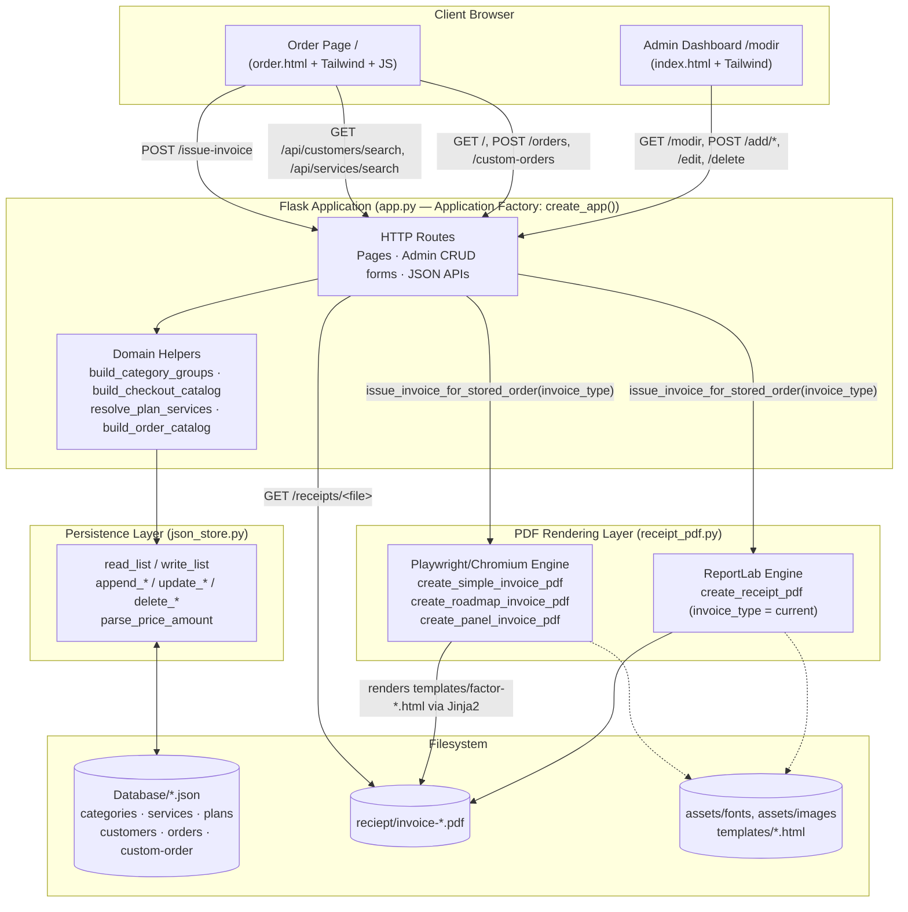
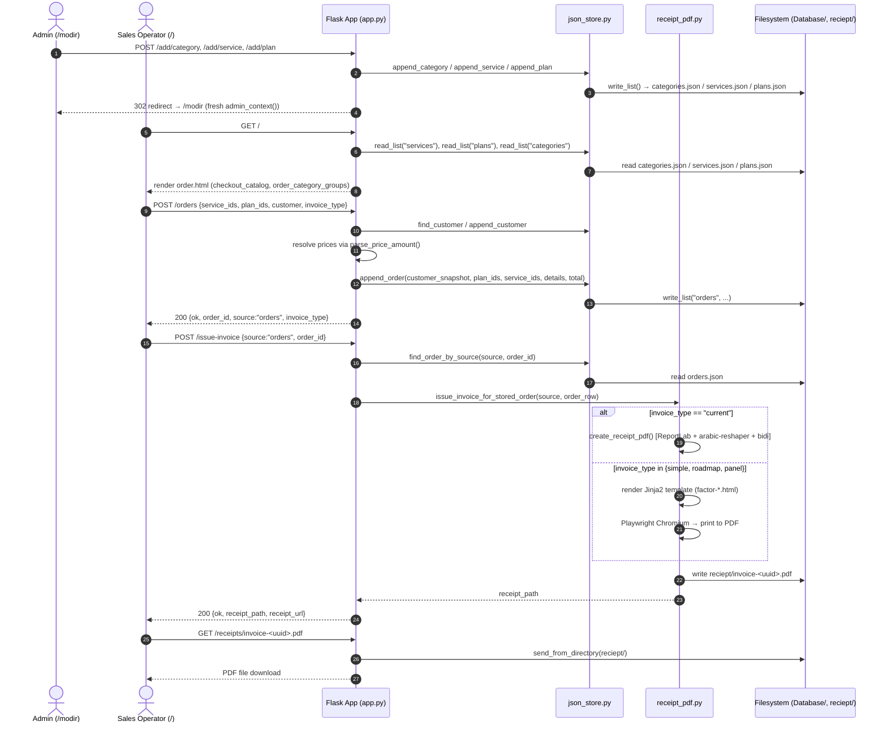
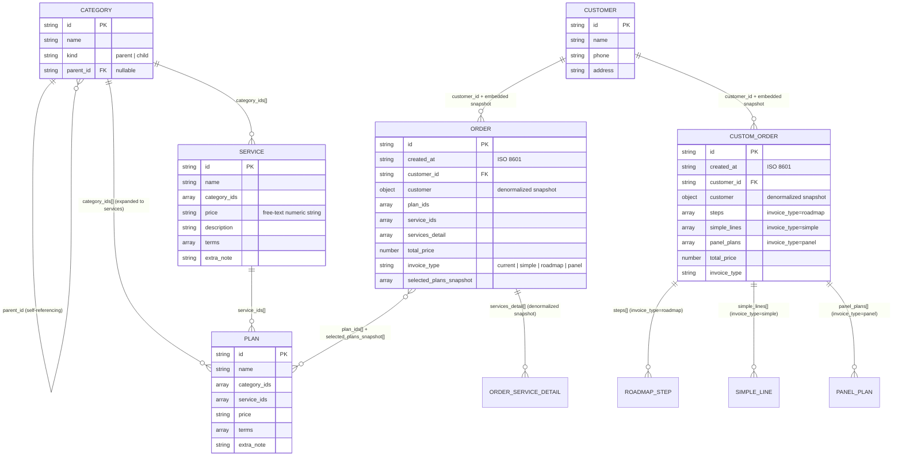
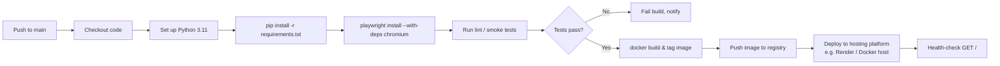

# Technical Specification & Architecture Document
## Team Projects Management — Baltazar Team Invoicing & Order System

| | |
|---|---|
| **Document Type** | Technical Specification & Architecture Document |
| **Project Name** | Team Projects Management (سیستم مدیریت پروژه و صدور فاکتور) |
| **Owner / Client** | Team Baltazar (تیم بالتازار) |
| **Version** | 1.0 |
| **Status** | Production (deployed) |
| **Live Reference** | https://teamprojectsmanagement.onrender.com/ |
| **Author** | Lead Systems Architect & Technical Author (generated specification) |

---

## Table of Contents

1. [System Overview](#1-system-overview)
2. [Architecture & Design](#2-architecture--design)
3. [Database & Data Modeling](#3-database--data-modeling)
4. [API / Interface Reference](#4-api--interface-reference)
5. [Configuration & Environment](#5-configuration--environment)
6. [Deployment & DevOps](#6-deployment--devops)
7. [Security & Error Handling](#7-security--error-handling)

---

## 1. System Overview

### 1.1 Executive Summary

**Team Projects Management** is an internal, single-tenant business-operations tool built for **Team Baltazar** to manage a service catalog (categories, services, and bundled plans), maintain a customer registry, capture sales orders, and automatically generate Persian (Farsi), right-to-left (RTL) PDF invoices in four distinct formats.

The system is a **Python/Flask monolith** with a **flat-file JSON persistence layer** (no relational database), a **server-rendered Jinja2 + Tailwind CSS** front end, and a **dual-engine PDF pipeline** combining ReportLab (native PDF drawing) and Playwright/Chromium (HTML-to-PDF rendering) to support rich, templated invoice layouts with full Persian typography (RTL shaping via `arabic-reshaper` and `python-bidi`, Persian digit conversion, and the custom **Dana** font family).

### 1.2 Business Domain

The application serves two operational roles:

| Role | Portal | Responsibility |
|---|---|---|
| **Admin / Manager (مدیر)** | `/modir` | Curates the catalog: hierarchical categories, individually priced services, and combination "plans"; manages the customer registry |
| **Sales / Customer-facing operator** | `/` (order page) | Selects services and/or plans for a customer (new or existing), captures order details, and issues one of four invoice types as a downloadable PDF |

### 1.3 Stakeholders

| Stakeholder | Interest |
|---|---|
| Team Baltazar (business owner) | Accurate, branded, Persian-language invoicing without third-party SaaS dependency |
| Sales operators | Fast order capture, flexible invoice formats (standard, simple, roadmap, tiered-panel) |
| End customers (invoice recipients) | Clear, professional, correctly formatted Persian invoices |
| Maintaining developer(s) | A small, dependency-light, file-based system that is easy to self-host and back up |

### 1.4 Technical Objectives

- Provide full **CRUD** management of categories (parent/child hierarchy), services, plans, and customers without requiring a database server.
- Support **two order pathways**: catalog-based standard orders and freeform custom orders (roadmap / simple / tiered-panel).
- Generate **legally presentable, Persian RTL PDF invoices** in four distinct visual formats from a single order record.
- Keep the operational footprint minimal: a single container image, no external DB, no message broker, no background worker infrastructure.
- Preserve full audit trail of orders and generated receipts on the container's persistent filesystem.

### 1.5 Non-Goals / Explicit Scope Boundaries

- No multi-tenant support — the system is scoped to one organization (Baltazar) with one implicit admin role and no authentication layer in the current implementation.
- No relational database, ORM, or query engine — all persistence is JSON-array-per-entity, read/rewritten in full on every mutation.
- No payment gateway integration; the system issues invoices, not payment collection.
- No user account system / login flow (see [Section 7](#7-security--error-handling) for the security implications of this).

---

## 2. Architecture & Design

### 2.1 Architectural Style

The system is a **modular monolith** following a lightweight **layered architecture**:

```
┌─────────────────────────────────────────┐
│           Presentation Layer             │  Jinja2 templates + Tailwind CSS + vanilla JS
├─────────────────────────────────────────┤
│         Application / Web Layer          │  Flask routes (app.py) — HTTP, validation, orchestration
├─────────────────────────────────────────┤
│            Domain / Service Layer        │  Catalog resolution, plan-service expansion,
│                                           │  price parsing, invoice-type routing
├─────────────────────────────────────────┤
│         PDF Rendering Layer              │  ReportLab (native draw) + Playwright/Chromium
│                                           │  (HTML → PDF) — receipt_pdf.py
├─────────────────────────────────────────┤
│          Persistence Layer               │  json_store.py — JSON file read/write, CRUD helpers
├─────────────────────────────────────────┤
│              Storage                     │  Flat JSON files under /Database, PDFs under /reciept
└─────────────────────────────────────────┘
```

There is no `models/` or `services/` package split at the filesystem level — the application deliberately keeps everything in four top-level modules (`app.py`, `json_store.py`, `receipt_pdf.py`, `seed.py`) rather than a package hierarchy, which is appropriate for its scale but is called out explicitly as a **scaling constraint** (see [§2.5](#25-architectural-constraints--technical-debt)).

### 2.2 High-Level Architecture Diagram



### 2.3 Request / Data Flow — Order-to-Invoice Lifecycle



### 2.4 Directory / Folder Structure

```
TeamProjectsManagement/
├── app.py                       # Flask application factory — all HTTP routes & orchestration logic
├── json_store.py                # Persistence layer — JSON CRUD, price parsing, order lookup
├── receipt_pdf.py               # PDF generation — 4 invoice engines (ReportLab + Playwright)
├── seed.py                      # Database seeding / fixture script
├── requirements.txt             # Python dependency manifest
├── Dockerfile                   # Container build definition (Playwright base image)
├── tailwind.js                  # Bundled Tailwind CSS (served at /tailwind.js)
│
├── assets/
│   ├── fonts/
│   │   └── Dana-Black.ttf       # Persian typeface — used in web UI and all PDF invoices
│   └── images/
│       └── logo.png             # Baltazar team logo (invoice header, UI branding)
│
├── Database/                    # Flat-file JSON persistence (source of truth)
│   ├── categories.json          # Hierarchical service categories (parent/child)
│   ├── services.json            # Individually priced services
│   ├── plans.json                # Bundled/combination plans (services + categories)
│   ├── customers.json           # Customer registry
│   ├── orders.json              # Standard (catalog-based) orders
│   └── custom-order.json        # Custom orders (roadmap / simple / panel invoices)
│
├── templates/                   # Jinja2 HTML templates
│   ├── index.html               # Admin dashboard (/modir) — dark-green theme, CRUD forms
│   ├── order.html                # Customer order page (/) — catalog selection, checkout
│   ├── factor-roadmap.html      # HTML→PDF template: staged/roadmap invoice
│   ├── factor-simple.html       # HTML→PDF template: simple line-item invoice
│   └── factor-panel.html        # HTML→PDF template: tiered pricing-card invoice
│
└── reciept/                     # Generated PDF output (auto-created at runtime)
    └── invoice-<uuid>.pdf
```

> **Note:** the receipts output directory is intentionally named `reciept/` (a project-level naming artifact preserved from the original source) rather than `receipt/`. Any deployment tooling or backup scripts must reference the exact directory name.

### 2.5 Architectural Constraints & Technical Debt

These are called out explicitly so they can be tracked as a technical backlog rather than silently inherited:

| Constraint | Impact | Recommended Mitigation |
|---|---|---|
| No relational database — full-file JSON read/write on every mutation | Not safe under concurrent writers; risk of lost updates or file corruption under parallel requests | Introduce file locking (e.g. `filelock`) or migrate to SQLite for a low-effort durability upgrade while keeping a single-file, DB-server-free deployment |
| No authentication/authorization on `/modir` or any mutating endpoint | Anyone with network access to the admin URL can alter catalog/pricing data | Add session-based auth (Flask-Login) or reverse-proxy basic auth in front of `/modir` and all `POST`/`/api/*` routes |
| `app.run(debug=True)` present in source for local development | Must never be enabled in production (stack traces, auto-reload, Werkzeug debugger RCE risk) | Production entry point uses Gunicorn (see Dockerfile) which bypasses Flask's dev server entirely — confirm `FLASK_DEBUG` is never set in the container environment |
| Playwright/Chromium dependency for 3 of 4 invoice types | Heavier container image and cold-start cost vs. a pure-ReportLab approach | Acceptable trade-off given the visual fidelity requirement of Jinja2-templated invoices; keep the official Playwright base image pinned |
| Monolithic `app.py` (938 lines) with all routes in one factory function | Harder to unit-test and scale for future contributors | Extract route groups into Flask Blueprints (`catalog_bp`, `orders_bp`, `admin_bp`) as the codebase grows |

---

## 3. Database & Data Modeling

### 3.1 Persistence Model

There is no relational database engine. Each entity is stored as a **JSON array of objects** in its own file under `Database/`, accessed exclusively through `json_store.py`. Every record uses a **UUIDv4** string as its primary key (`id`), generated via `uuid4()` at creation time.

| Store Key | File | Description |
|---|---|---|
| `categories` | `Database/categories.json` | Hierarchical service categories |
| `services` | `Database/services.json` | Individually sellable services |
| `plans` | `Database/plans.json` | Bundled plans composed of services and/or categories |
| `customers` | `Database/customers.json` | Customer registry |
| `orders` | `Database/orders.json` | Standard catalog-based orders |
| `custom-order` | `Database/custom-order.json` | Custom orders (roadmap / simple / panel) |

### 3.2 Entity-Relationship Overview



**Design rationale — denormalization by intent:** Both `orders` and `custom-order` embed a full **customer snapshot** (`name`, `phone`, `address`) and, for standard orders, a **service/plan detail snapshot** (`services_detail`, `selected_plans_snapshot`) at creation time. This is a deliberate choice, not an oversight: invoices must remain historically accurate even if a customer's contact details or a service's price/terms are edited later in the admin panel. The `customer_id` / service and plan IDs are retained for traceability, but the embedded snapshot is the source of truth for PDF rendering.

### 3.3 Schema Breakdown

#### 3.3.1 `categories.json`

| Field | Type | Description | Constraints |
|---|---|---|---|
| `id` | string (UUID) | Unique identifier | Required, primary key |
| `name` | string | Category display name | Required, non-empty (trimmed) |
| `kind` | string enum | `parent` or `child` | Defaults to `parent` if invalid/missing |
| `parent_id` | string (UUID) \| null | Parent category reference | Required when `kind = child`; null otherwise |

#### 3.3.2 `services.json`

| Field | Type | Description | Constraints |
|---|---|---|---|
| `id` | string (UUID) | Unique identifier | Required, primary key |
| `name` | string | Service display name | Required |
| `category_ids` | array\<string\> | Owning category/categories | May be empty |
| `price` | string | Free-text price; may contain Persian digits or words (e.g. `"12000000"`, `"۱۲ میلیون"`) | Parsed numerically by `parse_price_amount()`, which extracts digits only |
| `description` | string | Legacy free-text description field | Optional; superseded by `terms` + `extra_note` in current UI |
| `terms` | array\<string\> | Contract terms / clauses shown on invoices | Optional |
| `extra_note` | string | Supplementary note | Optional |

#### 3.3.3 `plans.json`

| Field | Type | Description | Constraints |
|---|---|---|---|
| `id` | string (UUID) | Unique identifier | Required, primary key |
| `name` | string | Plan display name | Required |
| `category_ids` | array\<string\> | Categories whose services are auto-expanded into the plan | May be empty |
| `service_ids` | array\<string\> | Explicitly included services (merged with category-resolved services) | May be empty |
| `price` | string | Free-text bundle price | Parsed via `parse_price_amount()` |
| `terms` | array\<string\> | Contract terms | Optional |
| `extra_note` | string | Supplementary note | Optional |

> Service membership resolution: `resolve_plan_services()` merges `service_ids` directly selected with services derived by expanding `category_ids` (including child subcategories) — see `build_plan_service_sources()` in `app.py`.

#### 3.3.4 `customers.json`

| Field | Type | Description | Constraints |
|---|---|---|---|
| `id` | string (UUID) | Unique identifier | Required, primary key |
| `name` | string | Customer full name | Required, non-empty |
| `phone` | string | Contact phone number | Optional |
| `address` | string | Postal / billing address | Optional |

#### 3.3.5 `orders.json` (Standard Orders)

| Field | Type | Description | Constraints |
|---|---|---|---|
| `id` | string (UUID) | Unique identifier | Required, primary key |
| `created_at` | string (ISO 8601) | Server-generated timestamp | Required |
| `customer_id` | string (UUID) | FK → `customers.id` | Required |
| `customer` | object `{name, phone, address}` | Denormalized snapshot at order time | Required |
| `plan_ids` | array\<string\> | Selected plan IDs | May be empty (if services selected) |
| `service_ids` | array\<string\> | Selected standalone service IDs | May be empty (if plans selected) |
| `services_detail` | array\<object\> | Per-item snapshot: `id`, `name`, `price`, `description`, `terms`, `extra_note` | At least one of `services_detail`/plan selection required |
| `total_price` | number | Sum of all resolved item prices | Computed server-side via `parse_price_amount()` |
| `invoice_type` | string enum | `current` (also covers `simple` submissions, normalized to `current` for this endpoint) | Normalized server-side |
| `selected_plans_snapshot` | array\<object\> | Plan-level snapshot: `id`, `name`, `terms`, `extra_note` | Optional |

#### 3.3.6 `custom-order.json` (Custom Orders)

| Field | Type | Description | Constraints |
|---|---|---|---|
| `id` | string (UUID) | Unique identifier | Required, primary key |
| `created_at` | string (ISO 8601) | Server-generated timestamp | Required |
| `customer_id` | string (UUID) | FK → `customers.id` | Required |
| `customer` | object `{name, phone, address}` | Denormalized snapshot | Required |
| `total_price` | number | Aggregate total | Computed server-side |
| `invoice_type` | string enum | `roadmap` \| `simple` \| `panel` | Required, normalized via `normalize_invoice_type()` |
| `steps` | array\<object\> | Present when `invoice_type = roadmap` — ordered stage objects with label/price | Conditional |
| `simple_lines` | array\<object\> | Present when `invoice_type = simple` — row items with quantity & unit price | Conditional |
| `panel_plans` | array\<object\> | Present when `invoice_type = panel` — pricing-tier cards | Conditional; tier key ∈ `{economic, bronze, silver, gold, diamond, exclusive}` |

### 3.4 Data Flow Summary

```
categories ──┬── services (category_ids[])
             └── plans (category_ids[] → resolved into services)

services ────── plans (service_ids[])

customers ───── orders / custom-order (customer_id + embedded snapshot)

orders ──────── services_detail[], plan_ids[], selected_plans_snapshot[]

custom-order ── steps[] | simple_lines[] | panel_plans[]   (mutually exclusive by invoice_type)
```

---

## 4. API / Interface Reference

All JSON APIs accept and return `Content-Type: application/json` unless otherwise noted. Admin CRUD forms use standard HTML form posts (`application/x-www-form-urlencoded`) and respond with `302 Found` redirects back to `/modir`.

### 4.1 Page Routes

| Method | Path | Description | Response |
|---|---|---|---|
| `GET` | `/` | Customer order page — service catalog grouped by category/subcategory, plan selection, checkout form | `200` — renders `order.html` |
| `GET` | `/modir` | Admin dashboard — full CRUD over categories, services, plans, customers | `200` — renders `index.html` |
| `GET` | `/tailwind.js` | Serves the bundled Tailwind CSS JS file | `200` — `application/javascript` |
| `GET` | `/assets/<path:filename>` | Serves static assets (fonts, logo) | `200` / `404` |
| `GET` | `/receipts/<path:filename>` | Serves a generated invoice PDF by filename (path-sanitized via `Path(filename).name`) | `200` — `application/pdf` / `404` |

### 4.2 Admin CRUD Endpoints (Form-Based)

| Method | Path | Purpose | Redirect |
|---|---|---|---|
| `POST` | `/add/category` | Create a category (`name`, `kind`, `parent_id`) | → `/modir` |
| `POST` | `/category/<cid>/edit` | Update a category's name/parent | → `/modir` |
| `POST` | `/category/<cid>/delete` | Delete a category (cascades: strips references from dependent services/plans, removes child subcategories) | → `/modir` |
| `POST` | `/add/service` | Create a service (`name`, `category_ids[]`, `price`, `terms[]`, `extra_note`) | → `/modir` |
| `POST` | `/service/<sid>/edit` | Update a service | → `/modir` |
| `POST` | `/service/<sid>/delete` | Delete a service (also removed from any plan's `service_ids`) | → `/modir` |
| `POST` | `/add/plan` | Create a plan; services resolved server-side from `category_ids` + `service_ids` via `resolve_plan_services()` | → `/modir` |
| `POST` | `/add/customer` | Create a customer (`name`, `phone`, `address`) | → `/modir` |
| `POST` | `/customer/<cid>/edit` | Update a customer | → `/modir` |
| `POST` | `/customer/<cid>/delete` | Delete a customer | → `/modir` |

### 4.3 Order & Invoice JSON APIs

#### `POST /orders` — Create a standard (catalog-based) order

**Request body:**
```json
{
  "service_ids": ["b129d3a0-...", "adc94c12-..."],
  "plan_ids": ["568e1dd4-..."],
  "customer_mode": "new",
  "customer": {
    "name": "شرکت نمونه",
    "phone": "09121234567",
    "address": "تهران، خیابان نمونه"
  },
  "invoice_type": "current"
}
```
`customer_mode` is `"new"` (creates a customer record) or `"existing"` (requires `customer_id` instead of `customer`).

**Success response — `200 OK`:**
```json
{
  "ok": true,
  "order_id": "d670b189-718c-fbd8-c196-d95f99e6c29f",
  "source": "orders",
  "invoice_type": "current"
}
```

**Error responses:**

| HTTP Status | `error` code | Condition |
|---|---|---|
| `400` | `no_items` | Neither valid `service_ids` nor `plan_ids` resolved to real catalog entries |
| `400` | `customer` | `customer_mode = existing` but `customer_id` missing |
| `400` | `customer_not_found` | `customer_id` does not match any record |
| `400` | `name` | `customer_mode = new` but `customer.name` missing/empty |
| `400` | `customer_create` | Customer record creation failed server-side |

#### `POST /custom-orders` — Create a custom order

**Request body (shape depends on `invoice_type`):**
```json
{
  "invoice_type": "roadmap",
  "customer_mode": "new",
  "customer": { "name": "...", "phone": "...", "address": "..." },
  "steps": [
    { "title": "فاز اول: طراحی", "price": "10000000", "description": "..." }
  ]
}
```
- `invoice_type = "roadmap"` → body includes `steps[]`
- `invoice_type = "simple"` → body includes `simple_lines[]` (quantity + unit price rows)
- `invoice_type = "panel"` → body includes `panel_plans[]` (tier key ∈ `economic|bronze|silver|gold|diamond|exclusive`)

**Success response — `200 OK`:**
```json
{
  "ok": true,
  "order_id": "94a291a4-6e3d-1011-4f10-22b8ab08db1a",
  "source": "custom-order",
  "invoice_type": "roadmap"
}
```

#### `POST /issue-invoice` — Render and persist a PDF invoice for an existing order

**Request body:**
```json
{
  "source": "orders",
  "order_id": "d670b189-718c-fbd8-c196-d95f99e6c29f"
}
```
`source` ∈ `{"orders", "custom-order"}`.

**Success response — `200 OK`:**
```json
{
  "ok": true,
  "receipt_path": "reciept/invoice-3f4a1c9e.pdf",
  "receipt_url": "/receipts/invoice-3f4a1c9e.pdf"
}
```

**Error responses:**

| HTTP Status | `error` code | Condition |
|---|---|---|
| `400` | `bad_request` | `source` not in allowed set, or `order_id` missing |
| `404` | `not_found` | No order matches `source` + `order_id` |
| `500` | `roadmap_pdf` | Playwright/Chromium rendering raised a `RuntimeError` (e.g. browser not installed) |
| `500` | `pdf_failed` | Any other exception during PDF generation |

**Invoice type → rendering engine mapping:**

| `invoice_type` | Engine | Function | Description |
|---|---|---|---|
| `current` | ReportLab | `create_receipt_pdf()` | Standard invoice — customer table, service descriptions, plan terms, totals |
| `simple` | Playwright (HTML→PDF via `factor-simple.html`) | `create_simple_invoice_pdf()` | Row-based sales invoice: item, quantity, unit price, line total |
| `roadmap` | Playwright (HTML→PDF via `factor-roadmap.html`) | `create_roadmap_invoice_pdf()` | Staged/phased collaboration invoice with a visual timeline |
| `panel` | Playwright (HTML→PDF via `factor-panel.html`) | `create_panel_invoice_pdf()` | Tiered pricing-card invoice (economic → exclusive) |

### 4.4 Helper JSON APIs

#### `GET /api/customers/search?q=<query>&limit=<n>`
Case-insensitive substring search over customer `name` + `phone`. `limit` defaults to 12, capped at 20.

```json
{ "ok": true, "items": [ { "id": "...", "name": "...", "phone": "...", "address": "..." } ] }
```

#### `GET /api/services/search?q=<query>&limit=<n>`
Case-insensitive substring search over service names.

```json
{ "ok": true, "items": [ { "id": "...", "name": "..." } ] }
```

#### `POST /api/services/quick`
Idempotent "find or create" for quickly adding a service by name from the order screen.

**Request:** `{ "name": "طراحی لوگو" }`

**Response (existing):** `{ "ok": true, "id": "...", "name": "طراحی لوگو", "created": false }`
**Response (created):** `{ "ok": true, "id": "...", "name": "طراحی لوگو", "created": true }`
**Error — `400`:** `{ "ok": false, "error": "name" }` when `name` is empty.

---

## 5. Configuration & Environment

### 5.1 Runtime Requirements

| Requirement | Version / Detail |
|---|---|
| Python | 3.10+ |
| Flask | >= 3.0.0 |
| Playwright | >= 1.40.0 (with Chromium browser installed via `playwright install chromium`) |
| WSGI server (production) | Gunicorn |
| Container base image | `mcr.microsoft.com/playwright/python:v1.45.0-jammy` (ships Python + Playwright + Chromium preinstalled) |

### 5.2 Python Dependency Manifest (`requirements.txt`)

```
flask>=3.0.0
reportlab>=4.0.0
arabic-reshaper>=3.0.0
python-bidi>=0.4.2
jinja2>=3.1.0
playwright>=1.40.0
gunicorn
```

| Package | Purpose |
|---|---|
| `flask` | Web framework / routing / templating host |
| `reportlab` | Native PDF drawing engine for the `current` invoice type |
| `arabic-reshaper` | Reshapes Persian/Arabic glyphs for correct contextual rendering in ReportLab (which lacks native complex-script shaping) |
| `python-bidi` | Applies the Unicode Bidirectional Algorithm so RTL Persian text renders in correct visual order |
| `jinja2` | Template engine — both for web pages and for the HTML invoice templates fed into Playwright |
| `playwright` | Headless Chromium driver for HTML→PDF rendering of `simple`/`roadmap`/`panel` invoices |
| `gunicorn` | Production WSGI server (replaces Flask's development server) |

### 5.3 Configuration Variables

The application currently reads no environment variables for runtime configuration — all paths are resolved relative to the module location (`Path(__file__).resolve().parent`). The table below documents the effective configuration surface and recommended production additions:

| Variable | Current Source | Default | Recommended for Production Hardening |
|---|---|---|---|
| `PORT` | Hard-coded in Dockerfile `EXPOSE 5000` / Gunicorn bind | `5000` | Externalize via `$PORT` env var for PaaS compatibility (e.g. Render, which the live deployment uses) |
| `DATABASE_DIR` | Hard-coded: `Path(__file__).resolve().parent / "Database"` | `./Database` | Externalize to support mounting a persistent volume separate from the application image |
| `RECEIPTS_DIR` | Hard-coded: `Path(app.root_path) / "reciept"` | `./reciept` | Externalize similarly; mount as a persistent volume so invoices survive container redeploys |
| `FLASK_DEBUG` | Not set in production path (Gunicorn entry point bypasses `app.run()`) | Off | Must remain unset/`False` in all production and staging environments |
| `GUNICORN_WORKERS` | Not currently set (Gunicorn default) | Gunicorn default (1) | Tune based on expected concurrency; note the JSON file store is **not** safe for high write concurrency — see [§2.5](#25-architectural-constraints--technical-debt) |
| `SECRET_KEY` | Not currently set | Flask default (insecure) | **Must be set** before introducing any session-based authentication |

### 5.4 Static & Font Assets

| Asset | Path | Used By |
|---|---|---|
| Dana-Black.ttf | `assets/fonts/Dana-Black.ttf` | Web UI (`@font-face`), ReportLab PDF generation, Playwright-rendered HTML invoices |
| logo.png | `assets/images/logo.png` | Invoice headers, admin/order page branding |
| tailwind.js | `/tailwind.js` (root) | `index.html`, `order.html` — Tailwind Play CDN bundle served locally |

---

## 6. Deployment & DevOps

### 6.1 Containerization

```dockerfile
# Base image: official Playwright + Python image (ships Chromium preinstalled)
FROM mcr.microsoft.com/playwright/python:v1.45.0-jammy

WORKDIR /app

COPY requirements.txt .
RUN pip install --no-cache-dir -r requirements.txt

COPY . .

EXPOSE 5000

CMD ["gunicorn", "--bind", "0.0.0.0:5000", "app:app"]
```

**Key design decisions:**
- Using the **official Playwright Python image** eliminates the need to separately run `playwright install chromium` and manage system-level Chromium dependencies (fonts, sandboxing libs) inside the build — a common source of brittle Docker builds for Playwright-based apps.
- **Gunicorn** is the production entry point (`app:app`, referencing the `app` object exported at module level in `app.py` via `app = create_app()`), never Flask's built-in development server.

### 6.2 Build & Run — Local Docker

```bash
# Build the image
docker build -t team-projects-management:latest .

# Run with a persistent volume for data + receipts
docker run -d \
  --name tpm \
  -p 5000:5000 \
  -v $(pwd)/Database:/app/Database \
  -v $(pwd)/reciept:/app/reciept \
  team-projects-management:latest
```

> **Critical for production:** without the volume mounts above, both the JSON "database" and every generated invoice PDF live only inside the container's writable layer and are **lost on container recreation**. Any production deployment must mount `Database/` and `reciept/` to persistent storage.

### 6.3 Local (Non-Docker) Development Setup

```bash
git clone <repository-url>
cd TeamProjectsManagement

python -m venv venv
source venv/bin/activate        # or venv\Scripts\activate on Windows

pip install -r requirements.txt
playwright install chromium     # required for simple/roadmap/panel invoice types

python app.py                   # dev server on http://127.0.0.1:5000, debug=True
```

| URL | Purpose |
|---|---|
| `http://127.0.0.1:5000/` | Order page (customer-facing) |
| `http://127.0.0.1:5000/modir` | Admin dashboard |

### 6.4 CI/CD Workflow (Recommended GitHub Actions Pipeline)

The repository does not currently ship a CI/CD workflow definition. The following is the recommended pipeline structure for this stack, to be added as `.github/workflows/deploy.yml`:



```yaml
name: Build and Deploy

on:
  push:
    branches: [ main ]

jobs:
  build-test-deploy:
    runs-on: ubuntu-latest
    steps:
      - uses: actions/checkout@v4

      - uses: actions/setup-python@v5
        with:
          python-version: "3.11"

      - name: Install dependencies
        run: |
          pip install -r requirements.txt
          playwright install --with-deps chromium

      - name: Smoke test app import
        run: python -c "from app import app; print('Flask app loaded OK')"

      - name: Build Docker image
        run: docker build -t team-projects-management:${{ github.sha }} .

      # - name: Push to registry
      #   run: | 
      #     docker tag team-projects-management:${{ github.sha }} <registry>/team-projects-management:latest
      #     docker push <registry>/team-projects-management:latest

      # - name: Deploy
      #   run: <platform-specific deploy step, e.g. Render deploy hook>
```

### 6.5 Current Production Deployment

The live instance (`https://teamprojectsmanagement.onrender.com/`) is deployed on **Render**, a PaaS well-suited to this Dockerfile-driven, single-container architecture. Operational notes for this or any equivalent PaaS:

- Render's ephemeral filesystem means `Database/` and `reciept/` **must** be backed by a Render **persistent disk** (or migrated to external object storage) — otherwise catalog data and issued invoices are lost on every redeploy/restart.
- Cold starts on free/low tiers will be slower due to the larger Playwright/Chromium base image; budget for this in health-check timeout configuration.

### 6.6 Backup & Data Durability

Because the entire "database" is a set of JSON files, backup strategy is simplified but must not be neglected:

- Schedule periodic snapshotting of the `Database/` directory (e.g. nightly `tar` + off-host copy, or continuous sync if hosted on a platform with disk snapshot support).
- Treat `reciept/*.pdf` as an audit trail — retain per applicable invoicing/record-keeping regulations for the business jurisdiction.

---

## 7. Security & Error Handling

### 7.1 Current Authentication & Authorization Posture

**As implemented, the application has no authentication or authorization layer.** Both `/` and `/modir` — including every mutating `POST` endpoint (category/service/plan/customer CRUD, order creation, invoice issuance) — are reachable by any client with network access to the deployed URL. This is an accurate, load-bearing statement about the current codebase, not a hypothetical risk.

**Recommended remediation (prioritized):**

| Priority | Recommendation |
|---|---|
| **P0** | Place the admin dashboard (`/modir` and all its `POST` sub-routes) behind authentication — minimum viable: HTTP Basic Auth via reverse proxy (nginx/Caddy) or platform-level access control; better: Flask session auth with hashed credentials |
| **P0** | Restrict or authenticate the `/api/*` and order-creation endpoints if the order page is not intended to be fully public |
| **P1** | Set a strong, environment-sourced `SECRET_KEY` before adopting Flask sessions |
| **P1** | Rate-limit `/orders`, `/custom-orders`, and `/issue-invoice` to prevent abuse (e.g. Flask-Limiter) given they trigger disk writes and, for 3 of 4 invoice types, a Chromium process spawn |
| **P2** | Add HTTPS enforcement / HSTS at the proxy layer (typically handled by the PaaS, e.g. Render terminates TLS automatically) |

### 7.2 Input Validation

| Layer | Current Behavior |
|---|---|
| Server-side ID validation | `/orders` and `/custom-orders` filter incoming `service_ids`/`plan_ids` against the live catalog (`srv_by_id`, `plan_by_id` lookups) — unknown or forged IDs are silently dropped, not trusted |
| Required-field checks | Customer `name` is required for new customers (`400 error: "name"`); at least one valid service or plan is required for a standard order (`400 error: "no_items"`) |
| Price parsing | `parse_price_amount()` extracts numeric digits only from free-text price fields (supporting both Latin and Persian numerals), preventing non-numeric injection into totals |
| Path traversal protection | `/receipts/<filename>` calls `Path(filename).name` before serving, stripping any directory traversal segments (`../`) before the file lookup |
| JSON body parsing | All JSON endpoints use `request.get_json(silent=True) or {}`, defensively defaulting to an empty dict rather than raising on malformed JSON |

**Gaps to close:**
- No server-side length/format validation on `phone` or `address` fields.
- No CSRF protection on the admin's HTML `<form>` POSTs (Flask-WTF or a manual CSRF token should be introduced once authentication is added — CSRF is a materially higher risk once sessions/cookies are in play).
- No request size limits configured (`MAX_CONTENT_LENGTH`) — recommended to bound JSON payload size on public-facing order endpoints.

### 7.3 CORS

The application does not currently set any CORS headers, which — for a same-origin, server-rendered application with no separate frontend domain — is the correct default. If a separate frontend origin is introduced in the future, CORS should be configured explicitly and narrowly (`flask-cors` with an allow-list) rather than left permissive.

### 7.4 Encryption & Data-at-Rest

- **In transit:** TLS termination is expected to be handled at the hosting platform / reverse proxy layer (confirmed in place for the Render deployment).
- **At rest:** Customer PII (`name`, `phone`, `address`) is stored in plaintext JSON files. Given the absence of a database engine, at-rest encryption would need to be implemented at the filesystem/volume level (e.g. an encrypted disk on the hosting platform) rather than in application code.

### 7.5 Error Handling Strategy

| Failure Mode | Current Handling |
|---|---|
| Invalid/missing order data | `400` with a machine-readable `error` code (`no_items`, `customer`, `customer_not_found`, `name`, `customer_create`) |
| Order/invoice not found | `404` with `{"ok": false, "error": "not_found"}` |
| PDF rendering failure (Playwright) | Caught `RuntimeError` → `500` with `error: "roadmap_pdf"` and the underlying message |
| Any other PDF generation exception | Caught generic `Exception` → `500` with `error: "pdf_failed"` and the underlying message |
| Malformed JSON body | Silently defaults to `{}` via `get_json(silent=True)`, surfaced downstream as a standard validation error rather than a raw parse exception |
| Cascading deletes | Category deletion cleans up dependent subcategories and strips the deleted category's ID out of any service/plan `category_ids` reference, preventing orphaned references |

### 7.6 Troubleshooting / FAQ

**Q: `POST /issue-invoice` returns `{"error": "roadmap_pdf"}` — what's wrong?**
A: This indicates the Playwright Chromium browser failed to launch or render. Confirm `playwright install chromium` was run in the deployment environment (already satisfied automatically if using the provided Dockerfile's Playwright base image). Check container memory limits — headless Chromium requires a reasonable memory ceiling and can fail silently on very constrained instances.

**Q: An invoice PDF downloads as 404 from `/receipts/<file>`.**
A: The `reciept/` directory is either not persisted (ephemeral container filesystem — see [§6.5](#65-current-production-deployment)) or the filename was altered/guessed rather than taken from a prior `/issue-invoice` response. Filenames are UUID-based and not guessable in the intended flow.

**Q: Prices display as `0` or incorrect on an invoice.**
A: `parse_price_amount()` extracts only digit characters from the stored price string. A price entered as purely descriptive text (e.g. `"توافقی"` — "negotiable", used intentionally for the `exclusive` panel tier) will correctly parse to `0` — this is expected behavior for negotiable-pricing tiers, not a bug.

**Q: Persian text renders visually reversed or with disconnected letterforms in the ReportLab (`current`) invoice.**
A: This is the exact failure mode that `arabic-reshaper` (contextual glyph shaping) and `python-bidi` (visual ordering) are installed to prevent. If it recurs, confirm both packages are present at the pinned/minimum versions in `requirements.txt` and that the Dana font file is being loaded successfully by ReportLab (check for a silent fallback to a non-Persian system font).

**Q: Admin catalog changes aren't reflected on the order page.**
A: The catalog is re-read from disk (`read_list(...)`) on every request — there is no in-memory caching layer, so this should not occur under normal operation. If it does, verify both processes (if running multiple Gunicorn workers) are reading from the same mounted `Database/` volume, not divergent local copies.

**Q: Can two admins edit the catalog at the same time safely?**
A: Not guaranteed. The JSON file store performs a full read-modify-write on every mutation with no locking (see [§2.5](#25-architectural-constraints--technical-debt)). Concurrent writes from multiple Gunicorn workers or simultaneous admin sessions carry a risk of one write overwriting another. Until file locking or a database migration is introduced, treat single-writer-at-a-time as an operational assumption, not a guarantee enforced by the code.

---

## Appendix A — Invoice Type Reference

| `invoice_type` | Rendering Engine | Template / Function | Typical Use Case |
|---|---|---|---|
| `current` | ReportLab | `create_receipt_pdf()` | Standard invoice with full customer table, itemized service descriptions, plan terms, and total |
| `simple` | Playwright (`factor-simple.html`) | `create_simple_invoice_pdf()` | Straightforward sales invoice: row, description, quantity, unit price, total |
| `roadmap` | Playwright (`factor-roadmap.html`) | `create_roadmap_invoice_pdf()` | Phased/staged project invoice with a collaboration timeline |
| `panel` | Playwright (`factor-panel.html`) | `create_panel_invoice_pdf()` | Tiered pricing-card invoice across six tiers: economic, bronze, silver, gold, diamond, exclusive |

## Appendix B — Pricing Tier Keys (Panel Invoice)

| Key | Persian Label |
|---|---|
| `economic` | اقتصادی |
| `bronze` | برنز |
| `silver` | نقره‌ای |
| `gold` | طلایی |
| `diamond` | الماسی |
| `exclusive` | اختصاصی (negotiated pricing) |

---

*End of document.*
